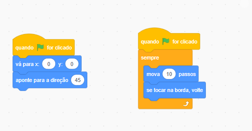
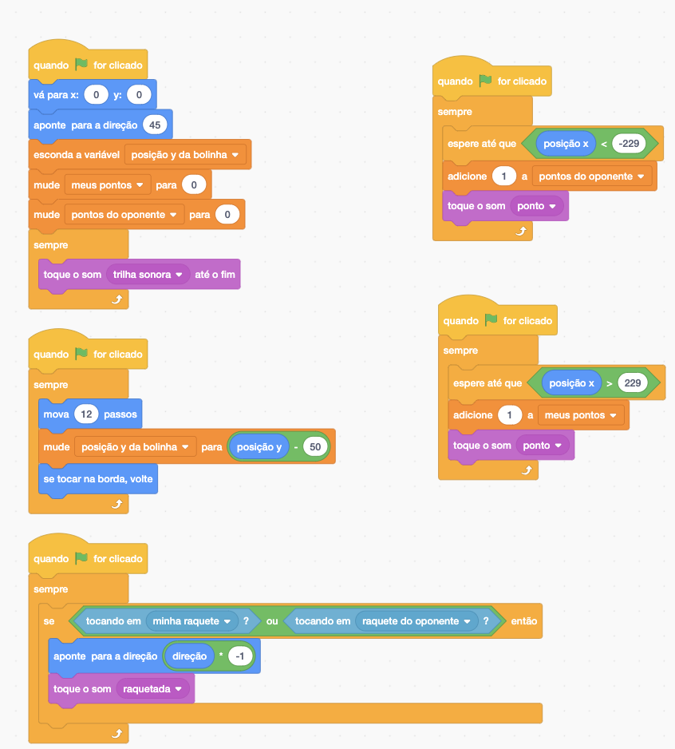
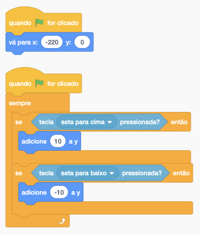
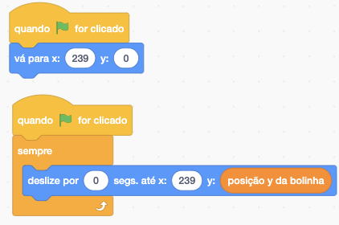

# 01 - Introdução
### Curso ministrado pelo instrutor: **Guilherme Lima**

Aqui iremos desenvolver um jogo de esporte conhecido por **Pong**, que simula um tênis de mesa.

De inicio iremos desenvolver ele utilizando uma linguagem **_Scratch_**. Na sequência após aperfeiçoarmos nossa lógica de programação, desenvolveremos o mesmo jogo utilizando outra linguagem, o **JavaScript**.


# 02 - O primeiro desafio do curso

Conhecer as duas ferramentas da **comunidade Alura**, o [_Discord_](https://discord.com/invite/QeBdgAjXnn) e o [_Fórum_.](https://cursos.alura.com.br/extra/alura-mais/como-turbinar-seus-estudos-utilizando-o-forum-c1362)

[Como participar da comunidade da Alura pelo Discord](https://www.alura.com.br/artigos/como-participar-comunidade-alura-discord?utm_source=gnarus&utm_medium=timeline)

[Como turbinar seus estudos utilizando o fórum](https://cursos.alura.com.br/extra/alura-mais/como-turbinar-seus-estudos-utilizando-o-forum-c1362)

# 03 - Como usar o fórum 

O Fórum é um local para que seja sanados as dúvidas que teve em algum determinado curso. Sendo exclusivo para duvidas, caso não haja, podemos estar utilizando ele para ajudar em responder algumas que lá estejam.

# 04 - Preparando o ambiente

Iremos criar um jogo do zero, utilizando duas linguagens de programação diferentes: [Scratch](https://scratch.mit.edu/) e [Javascript](https://www.alura.com.br/apostila-html-css-javascript/38CA-eventos-com-javascript) dentro do [P5](https://editor.p5js.org/).

Neste curso, não iremos utilizar uma IDE (ex: _VsCode_), pois para podermos usufruir das funcionalidades na prática, precisariamos subir um servidor e não é o foco. 

Para isso, precisamos realizar um cadastro no site _Scratch_ para salvar e compartilhar seus projetos dentro do Scratch.

# 05 - Primeiros passos com Scratch

Após estarmos logado no Scratch, iremos na opção **criar**, aonde iremos criar o nosso jogo.

Desenhar os dois atores (a bola e a raquete), centralizando cada um deles, e retirando a borda.

# 06 - Desenho dos atores

``` javascript

/*Os atores precisam estar centralizados, para que as coordenadas que iremos utilizar na programação representem-nos verdadeiramente.

A centralização dos objetos que desenhamos fará toda a diferença no projeto devido ao sistema de coordenadas. Se o objeto não estiver centralizado irá acontecer alguns bugs, principalmente quando precisamos inverter a direção do ator.
*/

```
# 07 - Bolinha e minha raquete

Iremos estar utilizando o Scratch para criarmos o jogo _**Pont**_ e irmos fortalecendo a nossa lógica de programação. 

Após ter os cenários com os seus respectivos atores já inseridos e estilizados, para podermos definir aonde o nossa bolinha irá começar, vamos em **eventos** e informaremos que quando clicarmos na **banderinha _verde_** em **movimentos** iremos selecionar uma posição inicial.

Nosso projeto irá ficar conforme a imagem abaixo: 




# 08 - Direção de movimento

# 09 - Bolinha e minha raquete parte 2

# 10 - Movimento da Raquete

# 11 - Oponente e placar

Para podermos compartilhar a posição da bolinha, iremos precisar criar uma variável, na qual irá armazenar a posição que a bolinha está e assim, podermos compartilhar em outros escopos do código com outros atores.

# 12 - Variáveis

# 13 - Oponente e placar parte 2

# 14 - Pontuação

# 15 - Sons e compartilhando o jogo

# 16 - Faça como eu fiz na aula

Foi aprendido nesta aula a desenvolver a lógica para desenvolver o jogo _pong_, no qual inserindo os step by stpe corretos o jogo é possível ser desenvolvido com interação, placar e sons.

Abaixo o resumo de código:

**ator: _Bolinha_** 





**ator: _Minha Raquete_** 

**ator: _Raquete do Oponente_** 


# 17 - Jogo mais difícil

# 18 - O que aprendemos?

- Desenvolvemos o jogo do Pong utilizando a linguagem de programação Scratch;

- Implementamos a colisão da bolinha com as bordas, minha raquete e a raquete do oponente;

- Movimentamos a raquete do oponente de forma individual, para acertar a bolinha na maioria das vezes;

- Criamos o placar do jogo, indicando os meus pontos e do oponente;

- Adicionamos sons e editamos a página do jogo no Scratch para que outras pessoas possam jogar.